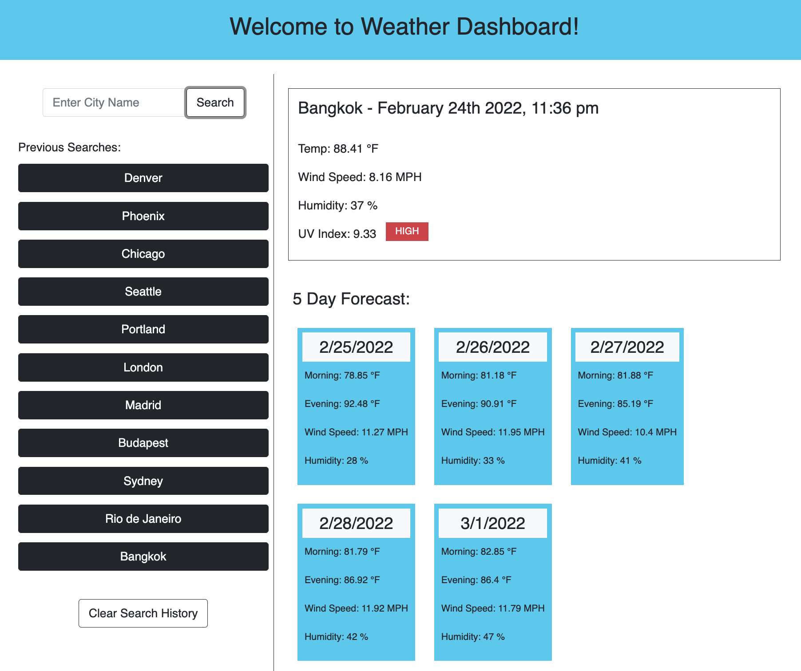

# Weather Dashboard

## Description

With the utilization of the Weather Dashboard application, a user can choose any city and at the click of a button they are presented with current weather conditions, as well as a 5-day forecast for that city.

## Features

- Search form for the user to type in what city they want to learn the weather / forecast of
- Previous Search History displayed underneath the search form, consisting of buttons that can be clicked to display the previously searched city's weather / forecast
- Button to clear Previous Search History & localStorage
- Display of Current Weather Conditions for any given city in the world
- Display of 5-day Weather Forecast below Current Conditions

## Screenshot

## Link to GitHub Repo

https://github.com/mfandel118/Weather-Dashboard-Homework6/

## Link to Deployed Application

https://mfandel118.github.io/Weather-Dashboard-Homework6/
